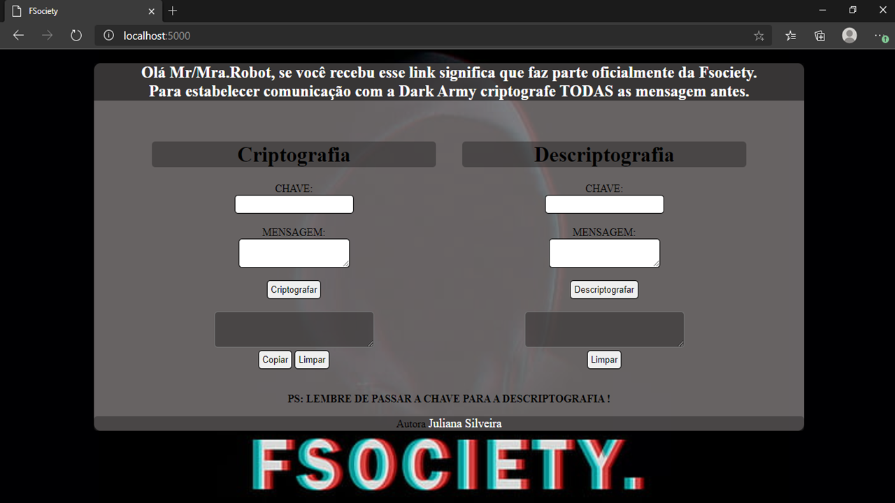
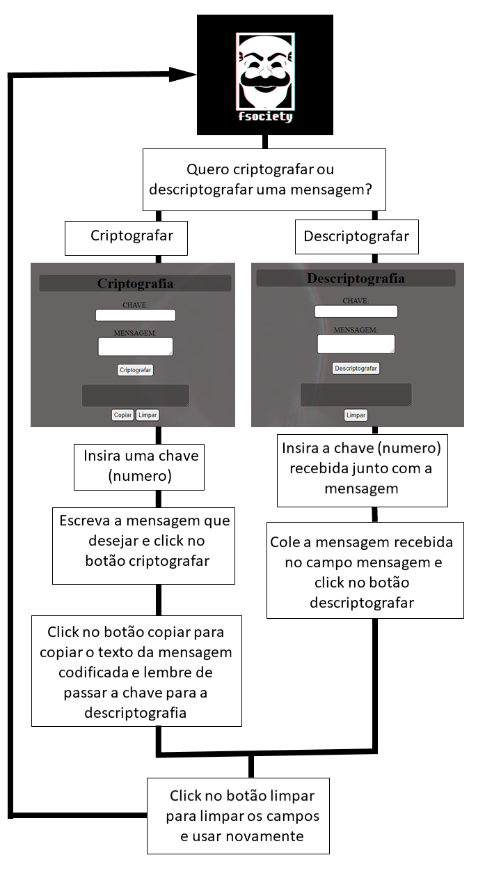

# FSociety - Criptografia & Descriptografia 

## :open_file_folder: Índice 

* [DESCRIÇÃO](#1-DESCRIÇÃO)
* [USUÁRIO](#2-USUÁRIO)
* [SITE](#3-SITE)
* [COMO USAR](#4-COMO-USAR)
* [DESENVOLVIMENTO DO PROJETO](#5-DESENVOLVIMENTO-DO-PROJETO)
* [AUTORA](#6-AUTORA)

***

## :pushpin: DESCRIÇÃO

O objetivo desse projeto é utilizar a tecnica de codificação criada por Julio César, 
o imperador romano, juntamente com a tematica apresentada na série de televisão Mr.Robot :tv:.
Sabendo que basicamente a Cifra de César é um metodo de substituição por deslocamento,
no qual uma letra é substituida por outra letra mais a frente do mesmo alfabeto, ajudamos o 
Mr.Robot consttruindo um site no qual ele poderá codificar e decodificar suas mensagens.

Caso você não conheça a série Mr.Robot. Aqui está o trailer para se sentir mais contextualizado [:clapper:](https://www.youtube.com/watch?v=8qZYW_1hj2g)

## :man_technologist:	USUÁRIO

Nossos usuários são os membros de FSociety, uma comunidade Hacker, que devido
a ataques recentes feito a E Corp está sendo viaja pelo FBI. Eles necessitam 
de maior segurança na comunicação para iniciar a Fase2 do plano.
Nosso canal serve para cifrar mensagens trocadas entre os proprios membros 
ou a com a comunidade Hacker Dark Army.

## :globe_with_meridians: SITE

Acesse esse site apenas se for membro da FSociety.
 

 
Click no link:

## :joystick: COMO USAR

## :chart_with_upwards_trend: DESENVOLVIMENTO DO PROJETO

O projeto foi desenvolvido basicamente em 10 etapas:

*  Rascunho  do projeto no papel
*  Construi o html 
*  Defini o tema do projeto
*  Fiz o CSS com base no tema 
*  Relizei a comunicação dos botões (html)  com o index.js
*  Desenvolvi a Cifra de César
*  Separei a Cifra do arquivo index.js
*  Coloquei o loop For para cifrar palavras inteiras
*  Adicionei if para permitir o " " nas frases Cifradas
*  Adiconei ajustes e escrevi o ReadMe

Obiviamente na praticava as etapas nãos se desenvoveram de forma totalmente linear
porém elas estão listadas para maior comprenção da linha de raciocinio da autora. 
Para observar a organização um pouco mais de perto acesse o [trello](https://trello.com/b/k7W8ulFX)

## :gear: AUTORA

Juliana Silveira 
 
Idéias? Vamos Conversar :left_speech_bubble:
 
juamorim.sn@gmail.com 

